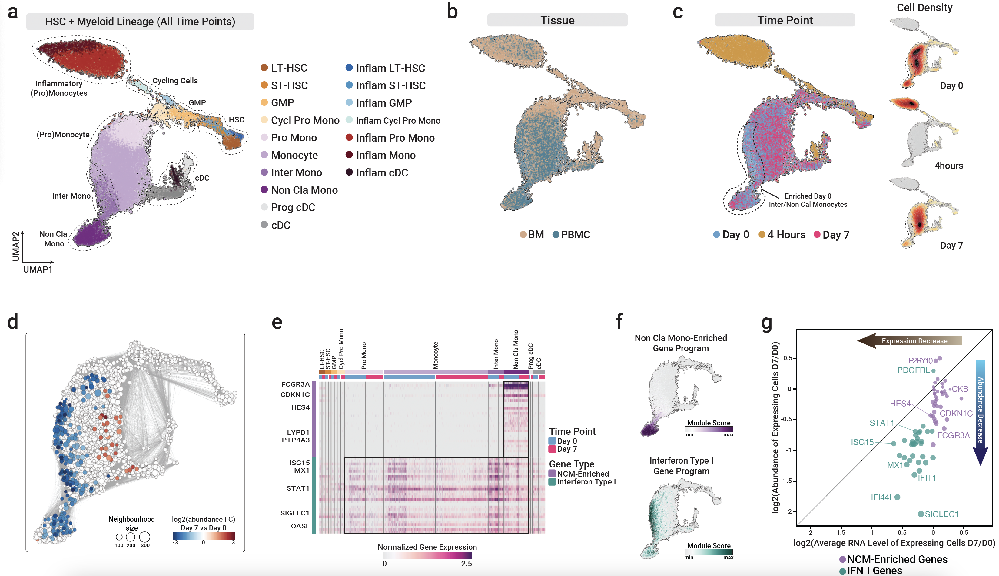

# Systemic inflammation impairs human myelopoiesis and interferon type I responses

This repository contains code for reproducing the key scRNA-seq-based findings of the short and long-term effects of LPS-induced systemic inflammation (**LPS-SI**) on hematopoiesis, especially myelopoiesis manuscript.
  

  
In order to run codes you need to:
 1. Download gene-cell count matrix from Gene Expression Omnibus (GEO) with the accession number of [GSE212093](https://www.ncbi.nlm.nih.gov/geo/query/acc.cgi?acc=GSE212093).
   

 2. Run the following script to generate the Seurat object containing scRNA-seq data from all samples (from all time points and tissues):
    * Please note that will need the resulting Seurat object of this step for the following downstream analysis.
    * [Visualize whole bone marrow and PBMC data from all time points using UMAP](./Analysis%20Scripts/All_Donors_Tissues_TimePoints.R)
  

 3. Follow any of the following analysis pipelines to replicate results of the paper:
    * [Acute (4h) response of myeloid cells to LPS-SI](./Analysis%20Scripts/Myeloid%20Cells%20Acute%20Response%20to%20LPS-SI.ipynb)
    * [Acute (4h) response of lymphoid T and NK cells to LPS-SI](./Analysis%20Scripts/Lymphoid%20T%20and%20NK%20Cells%20Acute%20Response%20to%20LPS-SI.ipynb)
    * [Acute (4h) response of lymphoid B and pDCs to LPS-SI](./Analysis%20Scripts/Lymphoid%20B%20and%20pDC%20Cells%20Acute%20Response%20to%20LPS-SI.ipynb)
    * [Late phase (day 7) effect of LPS-SI on myelopoiesis](./Analysis%20Scripts/Long%20Lasting%20Effect%20of%20LPS-SI%20on%20BM%20Myeloid%20Cells.ipynb)
    

For any further information or questions related to the analysis please contact Farid Keramati via [farid.karamati@gmail.com](mailto:farid.karamati@gmail.com) email address.
